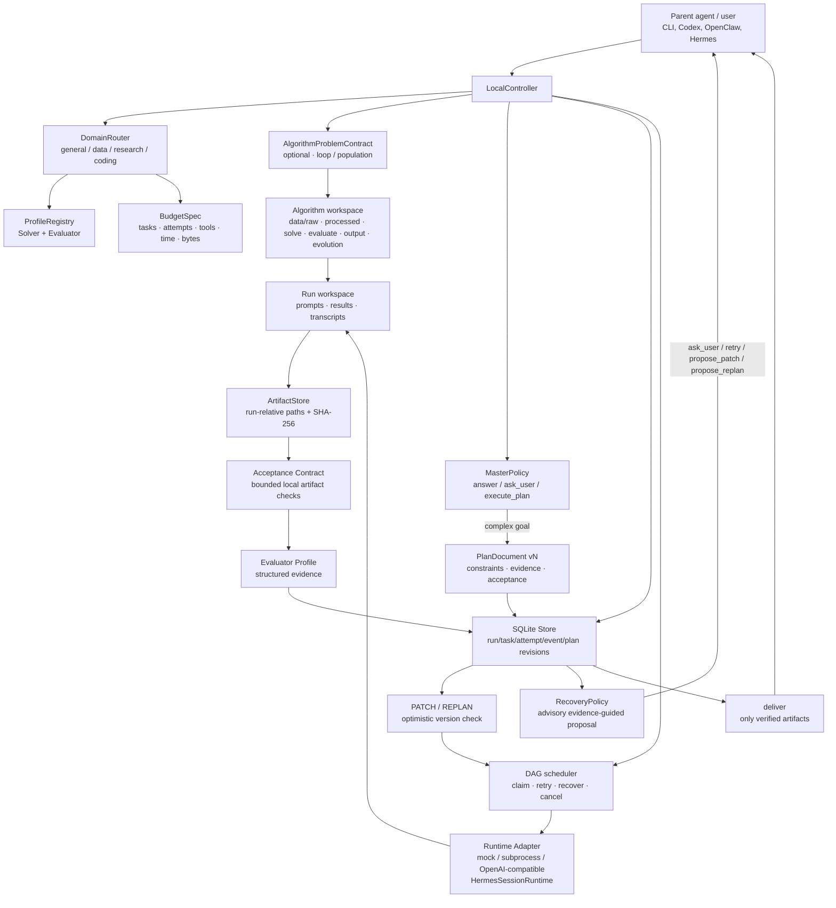

# Lunar-Agent architecture

Lunar-Agent keeps the useful *effect layer* ideas from WebAgent v2.5 while remaining a single
local process and an installable CLI. The model runtime is an adapter: Hermes-style sessions,
OpenAI-compatible endpoints, a subprocess agent, and the deterministic mock runtime all use the
same controller and ledger contracts.

## Control flow

1. `decide` applies the smallest-useful-action policy. Explanations return `answer` without a
   durable run. Underspecified goals return bounded `ask_user` questions. Multi-step goals produce
   a validated version-1 plan.
2. `plan` atomically writes the run, plan revision, logical task IDs, and policy decision. The
   store maps logical IDs (for example `research`) to run-scoped physical scheduler IDs, so plan
   documents remain readable without changing the legacy task primary key.
3. On creation, the deterministic Domain Router classifies every executable run as `general`,
   `data`, `research`, or `coding`, records its evidence, and selects runtime-neutral Solver and
   Evaluator Profiles. The default profiles preserve the existing non-empty result evaluation;
   callers may inject a stronger evaluator without changing a Runtime Adapter.
4. A plan may additionally carry an `algorithm_problem` contract. It is validated before durable
   execution, stored in the immutable plan revision, and materializes six fixed local role
   directories plus a digest-bearing `algorithm-workspace.json`. The contract records `loop` or
   `population` as a future strategy choice; Feature 012 does not execute either strategy.
5. The controller schedules ready DAG nodes. Each attempt writes a prompt and result artifact;
dependent nodes receive only verified predecessor artifacts and bounded previews. Runtime
adapters never own durable state. The selected evaluator profile establishes a base decision, then
an optional declarative acceptance contract independently checks result text and regular artifacts
only beneath that attempt workspace. Contracts can require file existence, artifact text, JSON
parsing/top-level keys, and `all`/`any` composition; they never execute commands, invoke a model,
or inspect an escaping path. Both decisions persist as a bounded structured evidence tree. A
retry preserves the task and plan contract and appends a bounded, task-scoped projection of the
latest failed evaluation (or generic runtime-failure guidance) to the next attempt prompt; raw
errors and result contents stay in their original ledger/artifact records.
per-run budget bounds task count, attempts, agent tool calls, elapsed controller time, and indexed
artifact bytes. Crossing a limit emits `budget_exceeded`, fails closed, and keeps existing artifacts
inspectable.
6. A failed or newly-informed run can receive `patch` or `replan` while idle. SQLite checks the
   current `(plan_id, version)` before applying a typed patch. Prior revisions stay immutable;
   not-yet-run tasks removed by a revision become `superseded`, while completed task definitions
   cannot be changed.
7. `recover` is a deterministic, advisory local policy over persisted task/evaluation/input/budget
   evidence. It returns `retry`, `ask_user`, `propose_patch`, `propose_replan`, `stop`, or `none`,
   writes each distinct proposal as a hashed audit artifact and idempotent event, and exposes the
   latest proposal in status JSON. It does not invoke a Runtime Adapter or model, execute a tool,
   mutate tasks, resume work, relax budgets, or apply a plan revision; a parent/user must choose an
   existing explicit command after reviewing the evidence.
8. `deliver` is a fail-closed decision. It requires a succeeded run, passing evaluator events for
   every succeeded task, and at least one indexed result/runtime artifact with a SHA-256 digest.

## Deliberate boundary versus WebAgent

The WebAgent branches demonstrated that Master routing, explicit clarification, solve/evaluate
separation, schema-driven artifacts, patch/replan lifecycle, and experience/memory capture improve
long-running work. Lunar-Agent makes the separation concrete with a restricted local acceptance
contract interpreter instead of accepting a Worker completion claim. The branches also contain
service concerns (HTTP/SSE, queues, cloud sandboxes, multi-tenancy, billing) and an OpenCode-specific
process model. Lunar-Agent adopts the portable behaviors and excludes those deployment assumptions.
A parent agent can invoke the JSON CLI as a child process, while a local user can run the same
binary without a Hermes installation or a machine-wide configuration directory.

## Invocation and evolution seams

The invocation seam and the search-strategy seam are deliberately independent:

| Seam | Supported forms | Durable authority |
| --- | --- | --- |
| Invocation | direct local CLI; parent-Agent child process with `--json`; detached handle followed by `resume` | SQLite run/plan ledger and run workspace |
| Evolution | `loop` (default); `population` (opt-in, future) | shared problem contract, candidate protocol, and frozen Evaluator |

In direct mode, the owner supplies the goal and observes the result. In child-process mode, a
parent such as Codex, Hermes, or OpenClaw supplies stdin/arguments and consumes bounded JSON
stdout; it does not become a required runtime dependency. In detached mode, the caller receives a
run ID before work finishes and can safely terminate; a later process reconstructs the same plan
revision, contract manifest, retries, and artifacts with `resume`.

`loop` is the first executable evolution path: each round gets a fresh Solver context, one
candidate is evaluated by the unchanged Evaluator, and best-so-far state is persisted. `population`
will add an archive and objective-based selection only when a long enough local budget demonstrates
that diversity offsets its bookkeeping and reduced per-lineage depth. The existing `--workers`
pool is scheduler parallelism for independent DAG tasks and must not be interpreted as a candidate
population.

## Recovery and migration

SQLite uses WAL mode. The controller recovers an interrupted `running` task as `uncertain`, then
replays it through the normal retry/evaluation path. Plan revisions are keyed by `(run_id, version)`
so the same plan template may be used by multiple runs; an additive migration upgrades the initial
feature-006 table and retains all documents. Feature 007 uses additive nullable route/profile
 columns plus JSON budget/evidence fields, so old runs still load with default limits. The run
 workspace is the artifact boundary and can be
inspected after the process exits.
