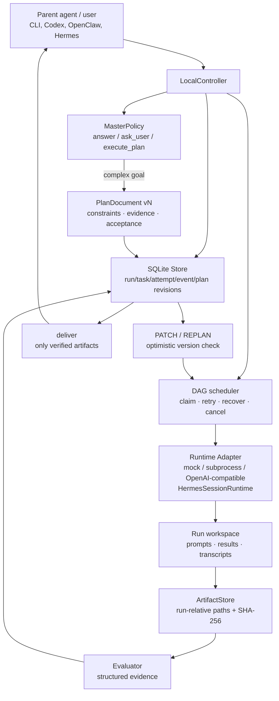

# Lunar-Agent architecture

Lunar-Agent keeps the useful *effect layer* ideas from WebAgent v2.5 while remaining a single
local process and an installable CLI. The model runtime is an adapter: Hermes-style sessions,
OpenAI-compatible endpoints, a subprocess agent, and the deterministic mock runtime all use the
same controller and ledger contracts.

## Control flow

1. `decide` applies the smallest-useful-action policy. Explanations return `answer` without a
   durable run. Underspecified goals return bounded `ask_user` questions. Multi-step goals produce
   a validated version-1 plan.
2. `plan` atomically writes the run, plan revision, logical task IDs, and policy decision. The
   store maps logical IDs (for example `research`) to run-scoped physical scheduler IDs, so plan
   documents remain readable without changing the legacy task primary key.
3. The controller schedules ready DAG nodes. Each attempt writes a prompt and result artifact;
   dependent nodes receive only verified predecessor artifacts and bounded previews. Runtime
   adapters never own durable state.
4. A failed or newly-informed run can receive `patch` or `replan` while idle. SQLite checks the
   current `(plan_id, version)` before applying a typed patch. Prior revisions stay immutable;
   not-yet-run tasks removed by a revision become `superseded`, while completed task definitions
   cannot be changed.
5. `deliver` is a fail-closed decision. It requires a succeeded run, passing evaluator events for
   every succeeded task, and at least one indexed result/runtime artifact with a SHA-256 digest.

## Deliberate boundary versus WebAgent

The WebAgent branches demonstrated that Master routing, explicit clarification, solve/evaluate
separation, schema-driven artifacts, patch/replan lifecycle, and experience/memory capture improve
long-running work. They also contain service concerns (HTTP/SSE, queues, cloud sandboxes,
multi-tenancy, billing) and an OpenCode-specific process model. Lunar-Agent adopts the portable
behaviors and excludes those deployment assumptions. A parent agent can invoke the JSON CLI as a
child process, while a local user can run the same binary without a Hermes installation or a
machine-wide configuration directory.

## Recovery and migration

SQLite uses WAL mode. The controller recovers an interrupted `running` task as `uncertain`, then
replays it through the normal retry/evaluation path. Plan revisions are keyed by `(run_id, version)`
so the same plan template may be used by multiple runs; an additive migration upgrades the initial
feature-006 table and retains all documents. The run workspace is the artifact boundary and can be
inspected after the process exits.

