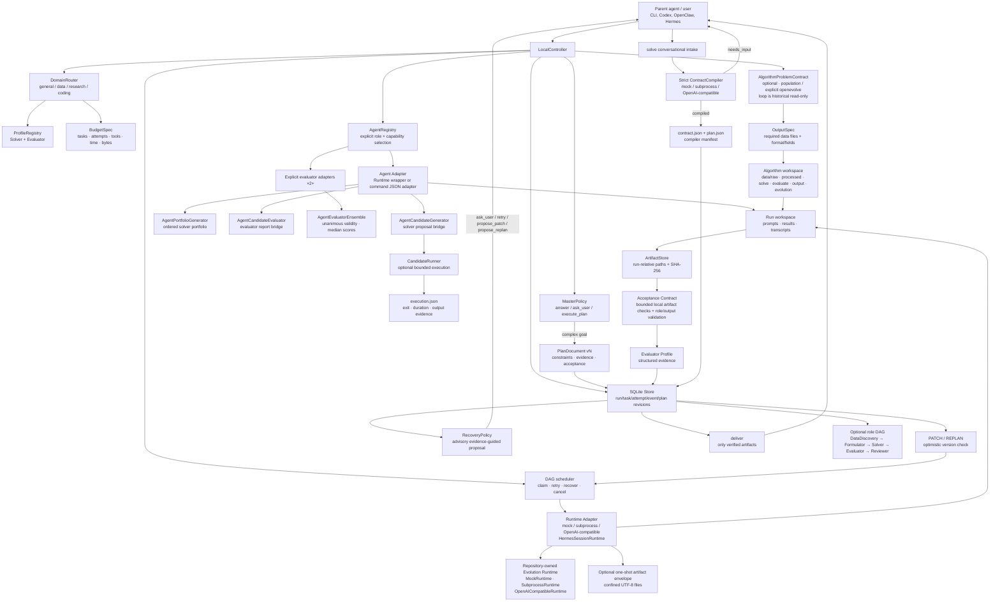

# Lunar-Agent architecture

Lunar-Agent keeps the useful *effect layer* ideas from WebAgent v2.5 while remaining a single
local process and an installable CLI. The model runtime is an adapter: Hermes-style sessions,
OpenAI-compatible endpoints, a subprocess agent, and the deterministic mock runtime all use the
same controller and ledger contracts.



The ordinary task runtime and the evolution runtime share the repository-owned adapter boundary.
For an evolution run, `--agent-runtime` constructs a fresh runtime-backed Agent adapter for each
unbound role and sends it through the existing strict candidate-generation/evaluation bridges:

```text
Repository-owned runtime profile
├── MockRuntime
├── SubprocessRuntime (explicit command)
└── OpenAICompatibleRuntime (explicit endpoint/model)
        ↓
RuntimeAgentAdapter (one fresh instance per role)
        ↓
AgentCandidateGenerator / AgentCandidateEvaluator
        ↓
population or explicit openevolve strategy → canonical candidate archive
```

This profile is the internal Agent skeleton for standalone Lunar-Agent use. It is intentionally small,
local, and dependency-free at the protocol boundary; no Hermes/OpenCode/Codex/Claude Code/DeepSeek
Harness process is required. A subprocess runtime or OpenAI-compatible server may still be backed
by any of those tools when the owner explicitly supplies the command or endpoint. Adding
`--agent-runtime-loop` wraps the explicit OpenAI-compatible model in the repository-owned
`AgentLoopRuntime`; the loop gets the same confined local tools as ordinary sessions, but remains
bounded by tool-step, workspace, timeout, and artifact limits.

## Control flow

1. `decide` applies the smallest-useful-action policy. Explanations return `answer` without a
   durable run. Underspecified goals return bounded `ask_user` questions. Multi-step goals produce
   a validated version-1 plan.
2. `plan` atomically writes the run, plan revision, logical task IDs, and policy decision. The
   store maps logical IDs (for example `research`) to run-scoped physical scheduler IDs, so plan
   documents remain readable without changing the legacy task primary key.
3. On creation, the deterministic Domain Router classifies every executable run as `general`,
   `data`, `research`, or `coding`, records its evidence, and selects runtime-neutral Solver and
   Evaluator Profiles. The default profiles preserve the existing non-empty result evaluation;
   callers may inject a stronger evaluator without changing a Runtime Adapter.
4. A plan may additionally carry an `algorithm_problem` contract. It is validated before durable
   execution, stored in the immutable plan revision, and materializes six fixed local role
   directories plus a digest-bearing `algorithm-workspace.json`. The strategy layer consumes this
   contract through one runtime-neutral seam: `population` is the default bounded local search, and
   `openevolve` is an explicitly configured local subprocess material producer. The historical
   `loop` tag remains readable, but new plans and evolution runs reject it. Optional `OutputSpec`
   entries make Solver data files explicit and inject independent `output_valid` checks into
   generated algorithm plans.
5. A caller may use `delegate`/`LocalController.run_agent` for a role-bearing worker. The explicit
   `AgentRegistry` selects only registered adapters satisfying every requested capability. A
   `RuntimeAgentAdapter` preserves the existing Runtime contract; `CommandAgentAdapter` invokes an
   absolute executable with one bounded JSON stdin/stdout exchange. No adapter is discovered from
   PATH or global Agent state.
6. The controller schedules ready DAG nodes. Each attempt writes a prompt and result artifact;
dependent nodes receive only verified predecessor artifacts and bounded previews. Runtime
adapters never own durable state. The selected evaluator profile establishes a base decision, then
an optional declarative acceptance contract independently checks result text and regular artifacts
only beneath that attempt workspace. Contracts can require file existence, artifact text, JSON
parsing/top-level keys, generic structured hand-offs, strict data profiles, strict
`EvaluationReport` files, and `all`/`any` composition; they never execute commands, invoke a model,
or inspect an escaping path. Both decisions persist as a bounded structured evidence tree. A
retry preserves the task and plan contract and appends a bounded, task-scoped projection of the
latest failed evaluation (or generic runtime-failure guidance) to the next attempt prompt; raw
   errors and result contents stay in their original ledger/artifact records. Evolution Agent calls
   additionally forward `agent_model_turn`, `agent_tool_result`, `agent_step_limit_reached`, and
   `agent_runtime_failure`; declared redacted transcripts are indexed as
   `evolution_agent_transcript` artifacts. Payloads contain identities, counts, statuses, and byte
   sizes only.
per-run budget bounds task count, attempts, agent tool calls, elapsed controller time, and indexed
artifact bytes. Crossing a limit emits `budget_exceeded`, fails closed, and keeps existing artifacts
inspectable.
7. A failed or newly-informed run can receive `patch` or `replan` while idle. SQLite checks the
   current `(plan_id, version)` before applying a typed patch. Prior revisions stay immutable;
   not-yet-run tasks removed by a revision become `superseded`, while completed task definitions
   cannot be changed.
8. `recover` is a deterministic, advisory local policy over persisted task/evaluation/input/budget
   evidence. It returns `retry`, `ask_user`, `propose_patch`, `propose_replan`, `stop`, or `none`,
   writes each distinct proposal as a hashed audit artifact and idempotent event, and exposes the
   latest proposal in status JSON. It does not invoke a Runtime Adapter or model, execute a tool,
   mutate tasks, resume work, relax budgets, or apply a plan revision; a parent/user must choose an
   existing explicit command after reviewing the evidence.
9. `deliver` is a fail-closed decision. It requires a succeeded run, passing evaluator events for
   every succeeded task, and at least one indexed result/runtime artifact with a SHA-256 digest.
   For an algorithm contract with required outputs, the Solver's attempt-local `output/` files must
   also pass independent format/field checks, be promoted to the run-level `output/` directory, and
   appear as `kind=output` artifacts; missing promoted outputs make delivery fail.
10. `solve` adds a conversational algorithm intake before the normal plan scheduler. The compiler
    returns only a strict `compiled` or `needs_input` envelope; the controller validates the nested
    contract, writes bounded compiler artifacts, and promotes the same run ID to a generated
    `data_discovery → formulate → solve → verify` DAG. Clarification uses the existing durable
    `awaiting_input`/`answer` lifecycle, so a parent Agent can poll one handle rather than joining
    separate intake and execution runs.
11. `solve --role-dag` selects the built-in five-role composition
    `data_discovery → problem_formulator → solver → evaluator → reviewer`. These are ordinary
    durable tasks, so roles remain runtime-neutral and can later be routed to explicit Agent,
    runtime, or evolution adapters without changing the controller or ledger. The four non-Solver
    hand-offs have strict acceptance rules: a bounded DataDiscovery profile, non-empty formulation
    and review markdown, and an `EvaluationReport`-validated `evaluate/evaluation.json`. Present
    role files are hashed as `role_evidence` artifacts even when another acceptance rule fails;
    delivery still requires the evidence to belong to the successful attempt.
12. A one-shot OpenAI-compatible turn may optionally return a strict `{text, artifacts}` envelope.
    `OpenAICompatibleRuntime` writes only bounded relative UTF-8 files under the private attempt
    workspace and returns their paths through `RuntimeResult`; the existing role/output acceptance
    and promotion boundaries remain authoritative. Tool-calling models continue to use the explicit
    `AgentLoopRuntime` path.
13. `solve --evolve` compiles the contract first, then creates a linked child evolution run. The
    intake retains the contract and supersedes only unstarted generated-plan tasks; the child owns
    strategy state and candidate artifacts. Verified `input_data` rows are copied by digest into
    the child workspace. A deterministic link event makes resume idempotent and strategy setting
    changes fail closed. This is an orchestration convenience, not a service or a new strategy.
14. Evolved output publication stages the complete verified batch under the parent workspace's
    `.evolved-output-publications/` directory. A bounded immutable journal binds the parent, child,
    owner, output metadata and staged file identities. A parent-wide process lock serializes
    publishers. Final paths use no-clobber hard links, and SQLite commits all new artifacts,
    artifact events, the existing promotion event and a journal-digest acknowledgement in one
    FULL-synchronous transaction. Existing identical output files and ledger owners are preserved.
    Every destination file and its directories are synced before commit.
    Recovery validates the whole batch and database snapshot before keeping committed outputs or
    removing uncommitted links proven to belong to this attempt. Unknown state or changed evidence
    stops delivery and retains the attempt. A missing journal cannot silently bypass an existing
    commit acknowledgement. Staging, journals and rollback acknowledgements are retained.
15. Terminal materialization publication retains exact result bytes and a journal under the
    child's `evolution/materialization/.terminal-publication/`. A SQLite preparation receipt binds
    the journal, result digest and parent/child/task identities before the marker is linked into
    place and synced. One FULL-synchronous transaction then records the result artifact, its
    artifact event, the existing parent materialization event and a commit acknowledgement.
    A filesystem completion receipt is durable before a normal return. Resume may complete a
    prepared result or a missing completion receipt after validating all prior execution/output
    evidence. A completed result with missing or conflicting marker/database evidence is rejected.
16. Final candidate launch has a separate durable intent under the child's
    `evolution/materialization/launch-intent.json`. After preparing inputs and the runner, the
    controller syncs the source copy, canonical intent and directories, then records an exact
    digest-bound `materialization_launch_intended` event in a FULL-synchronous SQLite transaction.
    Only that first preparation may enter the runner. A nonblocking
    `evolution/.materialization.lock` covers the entire materialization lifecycle, including all
    recovery and staging cleanup. Parent/child/contract/candidate identity is checked before and
    after lock acquisition. Existing or partial launch evidence prevents cleanup and relaunch.
    Before output or terminal recovery can write, an existing intent requires complete real
    execution evidence and its independently recorded artifact/event. An ambiguous runner
    exception preserves the attempt without inventing a pre-execution failure result.
17. Returned final executions are compared with the exact canonical `execution.json` and launch
    intent before the controller creates an execution journal under
    `evolution/materialization/.execution-publication/`. It syncs execution bytes and directories,
    then the journal, then an exact SQLite preparation receipt. A FULL-synchronous transaction
    records the execution artifact, its artifact event, the unchanged `evolved_candidate_executed`
    event and a commit acknowledgement. A durable completion receipt follows. Recovery under the
    lifecycle lock may complete only an exact prepared, wholly absent batch without any
    downstream output/terminal evidence. Partial batches and damaged completed records are
    rejected. Complete batches may finish only their missing completion receipt. Modern journal
    loss cannot downgrade to legacy replay. Existing execution validation and 088/089 recovery
    run afterward; terminal validation also checks modern execution publication integrity.
18. Complete modern execution registration can begin delivery preparation when no downstream
    evidence exists. Under the same lifecycle lock, independent output validation produces a
    canonical plan under `evolution/materialization/.delivery-publication/`, bounded to 64 KiB.
    It binds launch/execution digests, the existing result identity and validation, and ordered
    output byte metadata. Original output bytes, the plan and directories are synced before a
    FULL SQLite transaction records its exact `materialization_delivery_prepared` event. No
    output copy or new artifact row is needed. Artifact IDs and owners remain selected by 088
    under the parent lock, preserving legitimate reuse. Resume revalidates the original attempt
    and compares plan metadata with the output journal before any output reconciliation. A
    committed batch supplies the exact result projection; confirmed rollback creates a failed
    terminal with `output_publication_rolled_back` and no outputs. An absent batch may publish
    through the existing promoter. Exact prepared 089 results take precedence, with output
    inspection before terminal writes. After terminal completion, a bounded receipt binds the
    plan and result digests; its final or temporary presence forbids rebuilding deleted terminal
    records. Without a delivery plan, exact older prepared/complete terminal results retain their
    authorization after read-only output checks. For complete modern execution without a plan,
    other downstream fragments stop recovery before output rollback or new delivery preparation.
    Attempts without modern execution retain the older output recovery rules. 092 evidence also
    prevents 091 batch rebuilding.

The output publication transaction defines logical delivery in SQLite; filesystem readers may see
a prefix of final files before commit or until recovery runs after a crash. Reconciliation occurs
before terminal materialization replay and does not execute a candidate. Feature 089 can publish a
missing marker only from an exact durable terminal preparation. Feature 092 can create that
preparation from its verified delivery plan and exact output outcome, including after output
commit. Interrupted preparation and damaged publication evidence still require diagnosis of
retained staging. Feature 090 prevents automatic relaunch during the
candidate-launch-to-execution-evidence window. Feature 091 reconciles registration only after exact
execution preparation; raw or missing execution bytes cannot authorize it. A durable intent does
not prove that Popen happened: interruption before runner entry can leave zero executions and still refuse
retry. This is at most one authorized runner entry under the protocol, not exactly-once execution
or guaranteed completion. Surviving candidate processes are not identified or killed on resume.
19. `diagnose-materialization` is a strictly observational CLI path dispatched before normal
    configuration initialization. It copies the bounded SQLite database and optional WAL to a
    private temporary directory, then queries only the copy; it never creates source locks,
    initializes storage, runs recovery or executes a candidate. The report separately inventories
    launch, execution, delivery, output and terminal evidence, including partial and malformed
    records, and always marks `recovery_eligibility` as `not_assessed`. Source contents, directory
    entries and business records are preserved (ordinary read access-time changes are outside the
    guarantee). Missing, changing, busy or unsafe evidence is reported without reconstructing it.
20. `export-materialization-evidence` preserves a bounded review bundle outside both run
    workspaces. It is dispatched before configuration initialization, reuses the private DB/WAL
    snapshot and 093 observation, and writes only a no-clobber O_EXCL file after fsync. Events are
    represented by identity/type and payload size/digest; artifacts by identity/kind and size/
    digest. Goals, commands, candidate/output bytes, logs and raw payloads are excluded. The
    bundle remains observational with `recovery_eligibility: not_assessed` and cannot trigger
    recovery or prove delivery success.
21. `attest-materialization-execution` accepts one explicitly reviewed schema 1 receipt for an
    existing launch and retained execution. It freezes canonical receipt bytes before private
    DB/WAL preflight, then checks nonce uniqueness, ownership, candidate and execution fingerprints,
    device/inode and absent filesystem/database downstream evidence under the child lifecycle
    lock. The optional receipt in the 24 KiB execution journal binds one fixed-pair attestation
    event; that event and the 091 prepared event commit together in a FULL transaction with
    reciprocal digests. Execution batch commit and completion reuse 091. Identical receipts can
    explicitly retry a complete attested journal before DB preparation; automatic resume still
    cannot prepare raw evidence. After preparation, normal 091/092 recovery validates the retained
    attestation without the original receipt file and never reruns a candidate. Conflicting nonce,
    partial/unattested journals and downstream evidence are refused. Diagnostics and bundles
    observe the new event and digest associations without revealing receipt bodies or nonce.
    This operator statement supplies local authorization, not external identity or execution proof.

Intent files/events are retained without GC; coordinated removal of all of them is not externally
authenticated. The advisory locks coordinate these publishers, not unrelated same-user file writers.

## Deliberate boundary versus WebAgent

The WebAgent branches demonstrated that Master routing, explicit clarification, solve/evaluate
separation, schema-driven artifacts, patch/replan lifecycle, and experience/memory capture improve
long-running work. Lunar-Agent makes the separation concrete with a restricted local acceptance
contract interpreter instead of accepting a Worker completion claim. The branches also contain
service concerns (HTTP/SSE, queues, cloud sandboxes, multi-tenancy, billing) and an OpenCode-specific
process model. Lunar-Agent adopts the portable behaviors and excludes those deployment assumptions.
A parent agent can invoke the JSON CLI as a child process, while a local user can run the same
binary without a Hermes installation or a machine-wide configuration directory.

## Producer exports as population input

Feature 096 adds `export-shinka-result` as a thin CLI over the existing offline exporter. It parses
a bounded contract and dispatches before normal configuration/storage initialization. Program IDs
and top-k selection remain mutually exclusive, and the response describes an exported material
bundle rather than an admitted candidate.

`evolve --producer-result` uses the shared `prepare_producer_seed_manifest` function to verify the
completed envelope, caller-pinned producer identity and material bytes, then constructs an
unadmitted in-memory SeedManifest. The generic producer's source-bundle dependency digest and
declared-protocol environment digest are preserved. The controller's existing seed admission is
the only evaluation/receipt/commit path; no parallel scoring or admission schema is introduced.
The evaluator command uses the same objective-harness fingerprint as other seeded population runs.

Producer imports are population-only and cannot be mixed with an explicit seed manifest or seed
identity overrides. Existing resume checks bind config, manifest and canonical seed evidence;
revalidation uses the exact evaluator again. Detached startup forwards the original producer root
and pins so the child reconstructs the same manifest. These flags never install, discover or run
an external framework; ordinary generator/evaluator commands remain the caller's explicit choices.

## Benchmark task envelopes

Feature 097 defines `BenchmarkTaskEnvelope` as a static interchange boundary for
SkyDiscover/LLM4AD-style tasks. Strict canonical JSON binds task and benchmark identity,
contract/input digests, model and exact evaluator pins, candidate kind, and physical attempt budget.
`admit_benchmark_task_envelope` only verifies caller pins and confined local input bytes; it never
starts a producer, model, evaluator, scheduler or remote service. The comparison digest excludes
framework names and run IDs so equivalent workloads can be compared without importing their result
semantics. External scores and generation numbers remain outside Lunar score, rank and iteration state.

Feature 098 adds `BenchmarkComparisonPlan` for fixed-condition multi-arm comparisons. Its derived
comparison ID is based on the shared task workload and common contract/model/evaluator/candidate/
budget fields, while framework labels and run IDs stay outside the identity. Admission reuses the
097 read-only checks independently for every arm and keeps each arm's physical attempt budget
isolated. It is a plan validator, not a framework runner or result comparator.

Feature 099 adds `BenchmarkComparisonResult`, a strict offline receipt bound to that plan. It
accepts only bounded per-arm summaries and evidence digests, derives a stable result identity, and
rejects missing or extra arms. The receipt is measurement evidence; it does not import scores into
Lunar state or execute any producer, model or evaluator.

The `benchmark-comparison validate-result` CLI exposes this read-only admission before normal
configuration initialization, so a receipt can be checked without creating a Lunar home or Store.

Feature 100 adds optional evidence path/size descriptors and an explicit `--evidence-root` binding.
Result JSON and evidence are opened relative to held directory descriptors with `O_NOFOLLOW`, and
file opens use `O_NONBLOCK`. Before reading, regular-file type and byte limits are checked; afterwards,
device/inode/size/mtime/ctime and directory/file name bindings are rechecked. Reads are capped at
128 KiB plus one byte for result JSON or the declared evidence size plus one (maximum 16 MiB plus
one). Descriptor keys must both be present and non-null, or both omitted for legacy receipts.
Malformed inputs produce fixed result error codes. This is an observation of individual files,
not a multi-arm filesystem snapshot or certification of external measurements.

Feature 101 adds an optional `plan_sha256` to result receipts and their derived IDs. It hashes the
complete canonical plan, fixing the association of arm IDs with benchmark releases/publications in
addition to common conditions. Structural plan replay precedes both result creation and admission;
each task DTO is also rebuilt before input reads. `from_plan` creates a new pinned declaration without
IO, while `expected_plan_sha256`/CLI `--plan-sha256` require the caller pin, receipt pin and plan digest
to match. CLI output exposes `plan_bound` separately from byte evidence binding. Existing unpinned
receipt data and IDs remain unchanged. Task, plan, result and evidence reads now share the private
`_benchmark_files` descriptor reader; public errors retain their task/plan/result code namespaces.
Pins cover represented DTO fields, not unrepresented framework configuration or actual execution.

## Invocation and evolution seams

The invocation seam and the search-strategy seam are deliberately independent:

| Seam | Supported forms | Durable authority |
| --- | --- | --- |
| Invocation | direct local CLI; `delegate` with an explicit Agent command; parent-Agent child process with `--json`; detached handle followed by `resume` | SQLite run/plan ledger and run workspace |
| Evolution | `population` (default); Agent-backed generation; Agent-backed evaluation; `openevolve` (explicit local command); historical `loop` artifacts are read-only | shared problem contract, candidate archive, validity-first report, and relative result handoff |

In direct mode, the owner supplies the goal and observes the result. In child-process mode, a
parent such as Codex, Hermes, or OpenClaw supplies stdin/arguments and consumes bounded JSON
stdout; it does not become a required runtime dependency. In detached mode, the caller receives a
run ID before work finishes and can safely terminate; a later process reconstructs the same plan
revision, contract manifest, retries, and artifacts with `resume`.

`famou evolve CONTRACT` is the CLI/controller entry point for this seam. It creates one ordinary
SQLite run with an evolution task, copies the contract to `evolution/contract.json`, and records
`evolution_started`, `evolution_iteration`, `evolution_candidate_archived`, and
`evolution_finished` events. `--detach` returns the run ID before execution; `--resume --run-id`
re-enters the same task after a process exit. The strategy itself still owns only the local
archive/state files, while SQLite owns task lifecycle, cancellation, and the final run status.
Native command-backed runs add credential-safe generator and evaluator adapter fingerprints to the
strategy config. Resume compares those fingerprints before task claim, preventing a solver command,
evaluator command, Agent role, name, or capability change from silently extending an old archive.
Only canonical SHA-256 values are persisted; raw command arguments and credentials are not copied
into state.

Conversational callers may use `solve --evolve` as a two-run handoff. The intake run first accepts
the same strict contract used by ordinary `solve`; its generated DAG is recorded but unstarted
tasks are marked `superseded`, then `LocalController.copy_staged_inputs` materializes the verified
`data/raw/` artifacts in a child `evolution-run` workspace. Runtime-backed solver and evaluator
role adapters run the selected strategy there. The intake's `evolution_linked` event contains only
the child ID, contract digest, and strategy, so polling or resuming cannot duplicate the child or
leak prompts, commands, endpoints, or credentials.

`population` is the active native library strategy over the append-only archive. It maintains
bounded active IDs, objective-aware score/novelty selection, optional islands, and ring migration
while retaining the full archive. `LoopStrategy` remains an importable, non-mutating compatibility
stub whose `run()` and `resume()` calls fail with `loop_strategy_retired`; historical loop contracts,
candidates, archives, and benchmark results remain readable. `AgentCandidateGenerator` adapts an
explicit role-bearing solver Agent to the generation seam, while `AgentCandidateEvaluator` adapts a separate
evaluator Agent that must return one strict JSON `EvaluationReport`. The report is parsed and
validated by Lunar-Agent before validity-first selection; evaluator prose, status claims, and
malformed JSON are never accepted as evidence. The solver and evaluator may be different commands
and roles, and both remain optional adapters rather than required runtime dependencies. For
higher-assurance runs, `AgentEvaluatorEnsemble` composes two or more explicit evaluator adapters:
each member receives the same candidate and contract through an isolated workspace, validity must
be unanimous, and valid numeric evidence is aggregated with a median. A member failure, malformed
report, or validity disagreement produces an invalid aggregate report.
`openevolve` is only an adapter: it receives an explicit executable and a generated config, then
imports a validated result into Lunar-Agent's canonical archive. The existing `--workers` pool is
scheduler parallelism for independent DAG tasks and must not be interpreted as a candidate
population.

### Candidate source bundles

`candidate_bundle.py` defines the independent `lunar-candidate-source-bundle-v1` manifest. Its
canonical digest binds the algorithm contract, entrypoint and every declared path/size/SHA-256,
sorting file descriptors by path. `validate_candidate_source_bundle` deeply reconstructs typed
values without IO; `verify_candidate_source_bundle` checks the required contract pin and optional
bundle pin before observing sources. The result carries bundle metadata and byte counts only.

Paths are NFC relative POSIX names with no traversal, control/format characters, `.git` components,
case-folded component aliases or file/directory conflicts. The private descriptor-based reader
checks bounded regular-file bytes, file identity and ancestor name bindings. UTF-8 without NUL,
1–64 files, at most 1 MiB each and 16 MiB total, and a 128 KiB manifest bound keep observation local
and bounded. Empty files are valid. Source verification is per file and does not create an atomic
snapshot. Unlisted files are ignored, and no syntax, import closure, dependencies or environment
are verified.

The static `candidate-bundle validate` CLI dispatches before config/Store initialization. It returns
only status, digests and counts. This separate contract leaves the single-file Candidate,
SeedManifest and ProducerResultEnvelope unchanged; repository execution, workflow graphs and
multi-file evaluator admission require subsequent designs. Feature 103 adds an isolated
`candidate-bundle materialize` boundary that copies verified bytes into a fresh private workspace
and validates a path-free runner plan, without execution, import, evaluation, or registration.

Feature 104 adds the next read-only boundary in `candidate_execution.py`. An immutable
`CandidateExecutionAdmission` binds the complete Feature 103 plan digest, bundle and contract
identities, sorted logical input descriptors, dependency/environment commitments, evaluator pin,
output-contract digest, and physical budget. Its canonical digest is path-free and excludes the
self-referential returned digest. `build_candidate_execution_admission` and
`parse_candidate_execution_admission` deeply reconstruct nested DTOs, while
`admit_candidate_execution` requires an explicit plan on replay and checks every caller pin before
optional input IO. A supplied input root is read through the existing bounded descriptor-based
no-follow path and each declared size/SHA-256 is rechecked; structural admission without a root
performs no filesystem IO.

This layer is an authorization declaration for a future runner, not an execution receipt. It does
not launch a command, import candidate code, inspect or install dependencies, inspect host
environment, invoke an evaluator, initialize home/Store, or write Candidate, receipt, archive,
resume, or materialization-ledger state. The core API, static
`candidate-bundle admit-execution` dispatch, and installed-CLI no-execution/no-home fixture are
implemented before normal initialization.

### Frozen effect protocols

The effect boundary is intentionally split into two protocols so normal model/tool turns cannot be
mistaken for outer evolution generations:

```text
effect-trial (normal)             effect-deep-trial (outer loop)
fresh attempt                     fresh attempt
  └─ subject once                    ├─ subject round 1 → exact harness
      └─ exact harness               ├─ subject round 2 → exact harness
                                     ├─ ...
                                     └─ subject round 5 → exact harness
```

`effect-deep-trial` defaults to the five outer rounds used by WebAgent's no-argument `/evolve`
source behavior. Every subject invocation is a fresh, stateless repository-owned Agent session;
continuity comes from the attempt files and a bounded `RoundFeedback` projection. That projection
contains only finite scores, generic allowlisted metrics, a hash-only candidate manifest, a
best-round pointer, and a repair/stagnation directive. Baseline rows, private evaluator files,
raw process output, and credentials remain outside the subject boundary. The private
extractor/evaluator remains the only score authority and runs after each round. A run's score is the
maximum valid round score, while invalid rounds remain in its record. Reports expose per-round best,
P50/P90, run-level score/validity/quality distributions, feedback directives, and strict deltas
against the imported normal WebAgent history. The comparison is descriptive and effect-layer
comparable, but deliberately does not claim WebAgent prompt/role identity, full-suite parity, or
statistical superiority.

The baseline converter checks every explicit FM-Eval adapter signal available in the experiment and
selected result receipts. It accepts only consistent `webagent` evidence; an AgentServer export or
conflicting adapter metadata fails before a baseline is written. Legacy exports with no adapter
field remain readable for compatibility and depend on separately preserved source provenance.

Resume re-reads every recorded subject telemetry field and harness metric, and verifies recorded
request digests. A clean incomplete prefix continues in the same attempt; process or boundary
failures restart in a new attempt while preserving earlier evidence. Reusing an unrecorded subject
round requires a matching request-bound receipt, while any unrecorded harness result is discarded
and rescored by the exact private harness. Logical-run records are reused only when their digest is
already registered in runner-owned state; other records get a new independently scored attempt.
A previous-record journal covers interruption between record and state replacement by restoring
only the last prefix whose digest still matches state. Legacy completed records remain readable,
but their pre-upgrade provenance cannot be strengthened retroactively; a fresh independently scored
run is required for the new integrity guarantee.

Deep reports also expose a bounded `failure_statistics` projection per case. It separates logical
run error codes from round feedback categories, records completed versus partial rounds, counts
timeouts, and emits one entry for every configured outer round. The projection is derived from
validated durable records only; it cannot supply or alter evaluator scores.

The `benchmark` command is a thin orchestration layer above this seam. It validates one canonical
contract, creates isolated `strategies/<name>` workspaces, and runs population or the explicit
OpenEvolve adapter with one common budget and evaluator identity. Each strategy receives a fresh
evaluator adapter, so mutable runtime state and factory failures remain isolated. A failure in one
strategy is captured in that strategy's report entry while the remaining comparisons continue. The
benchmark does not merge archives, change selection rules, or treat elapsed time as a quality score;
it exposes both so a human or parent Agent can make the tradeoff explicit. OpenEvolve receives the
same budget projection in its generated config, but its executable and result envelope remain
independently validated by `OpenEvolveStrategy`.

For population, benchmark factories may instead construct a fresh repository-owned runtime
for each solver/evaluator role. The one-shot profile uses `RuntimeAgentAdapter` directly; the
tool-capable profile wraps an explicit OpenAI-compatible runtime in `AgentLoopRuntime`. The profile
descriptor and loop settings are included in the report, while endpoint, model, command, and API
key remain out of persisted JSON. To compare one-shot with loop, run the same contract and budget
in separate benchmark workspaces.

An optional `CandidateRunner` executes each archived candidate before a legacy evaluator command is
invoked. It writes one bounded `execution.json` beside the candidate, and the controller indexes
that evidence as `candidate_execution`. The runner never decides validity or score; a wrapped
evaluator remains authoritative, and any runner failure overrides an otherwise valid-looking report
with `validity=0`. This creates a portable execution proof boundary without assuming a particular
language, test framework, or operating-system sandbox.

Conversational native evolution may opt into a repository-owned compiled evaluator. Lunar-Agent
first derives a value-free structural profile from the exact input ledger, then runs two bounded
runtime turns before candidate generation. The compiler emits an objective, restricted evaluator,
and self probes. After those probes execute successfully, a fresh auditor sees the contract,
profile, objective, and evaluator source but not the self probes or any candidate/search evidence.
It must independently construct complete constraint counterexamples and score-order anchors, which
are executed through the same preflight gate. Only then are `probes.json`, `audit.json`, evaluator,
objective, and profile frozen under protocol `frozen-evaluator-bundle-v2`. Resume verifies their
canonical bytes and aggregate fingerprint without model calls. This reduces correlated evaluator
and self-test omissions; it is not a claim that two calls to one configured model are fully
independent or that generated Python is an OS sandbox.

After admission, Lunar-Agent projects that scoring authority into native Agent generation without
delegating trust. The solver prompt preserves the full canonical hard/soft constraints and
assumptions and adds a bounded `scoring_contract` containing the objective, evaluator digest,
source excerpt, and bundle fingerprint. Each isolated generation also receives read-only exact
copies at `scoring/objective.md` and `scoring/evaluator.py`, plus a relative-path manifest. Compiler
and audit probes and the private profile stay outside generation workspaces. The copies are
documentation only: candidate execution is still followed by the independently reverified parent
evaluator, so changing a generation copy cannot alter scoring authority.

Cross-round learning is likewise archive-derived. A structured Agent candidate may declare a small
experiment plan—hypothesis, change tags, and target metric directions—but it cannot declare its own
outcome. Once the candidate is independently evaluated, prompt construction joins it with its
persisted parent and derives a verified experiment card from `EvaluationReport` scores and metrics.
Recent cards and bounded tag outcome counts are derived for active population runs and remain
readable from historical loop archives. Because this memory
is a pure projection of `archive.jsonl`, process recovery needs no transcript replay, second
knowledge store, reflection model, or mutable `insights.md` file.

The generation bridge then projects strategy selection plus that verified memory into one
`search_directive`:

```text
GenerationRequest + archive-derived experiment memory
        |
        +-- empty archive --------------------------> explore
        +-- parentless, latest candidate invalid ---> repair
        +-- parentless, valid history --------------> diversify
        +-- valid parent ----------------------------> refine
        +-- valid parent + inspirations ------------> recombine
```

The directive names exact parent/inspiration/repair evidence, bounded evaluator error codes, proven
change tags, and tags with only measured non-successes. It is prompt guidance, not a new strategy
authority: population selection and budgets, evaluator validity, and archive ranking are
unchanged. A fresh process derives the same directive from `GenerationRequest` and `archive.jsonl`,
so adaptive allocation adds neither a model-planner call nor mutable orchestration state.

The bridge also maps the canonical `problem_type` to a small `algorithm_playbook`. Unlike
WebAgent's large OpenCode-specific OR/ML skill surface, this is a fixed repository vocabulary of
standard-library-capable families and non-executable modeling/validation check labels:

```text
contract problem type ──> ordered family repertoire + domain checks
                              |
verified family attempts ─────+──> untried / least-tried allocation
selected target/lineage ──────+──> repair/refine family preservation
selected inspirations ────────+──> recombination alternatives
                              |
                              v
                    algorithm_playbook in solver prompt
```

This makes population diversity algorithmic rather than merely prompt wording: for example,
routing seeds can move across insertion, savings, local-search, and large-neighborhood families.
Exact family tags returned in bounded experiment declarations identify intent; their attempt and
improvement history is still derived only after independent evaluation. The playbook contains
constraint IDs but no raw rows, output contents, executable snippets, or third-party dependency
promise. It is reconstructed on resume and cannot alter evaluator or selection authority.

The native population selector consumes the same runtime-neutral family vocabulary. Within each
island it preserves the global valid elite, then one valid elite for each recognized family while
capacity remains, and finally fills by the existing evaluator score and code-token novelty rank.
Parent pools contain one valid elite per family; inspiration selection prefers valid cross-family
and mutually distinct representatives. Arbitrary tags never create niches, malformed or absent
metadata falls back to legacy ranking, and state still persists only active candidate IDs. A
restart reconstructs the same niches from the contract and append-only archive without another
model call or mutable population metadata.

The `--agent-runtime` evolution profile is mutually exclusive with OpenEvolve and is allowed to
fill either or both missing native seams. Explicit generator/solver and evaluator adapters remain
available for mixed configurations. When both seams are already explicit, a runtime option is
rejected rather than silently ignored. Runtime provenance is recorded as credential-safe digests;
detached children receive secrets only through `FAMOU_AGENT_RUNTIME_API_KEY`.

For Agent-backed generation, the bridge projects bounded `evaluation_feedback` from prior validated
reports into the next prompt. This lets a solver address constraint failures and weak metrics while
keeping candidate source, prompts, logs, and raw adapter errors out of the context. Feedback is
read-only evidence; it cannot alter evaluator validity or population ranking.

Population runs may use `AgentPortfolioGenerator`, which rotates two or more explicitly registered
solver adapters in deterministic round-robin order. The portfolio is a composition over the same
generation bridge, not a new strategy or service: each member receives a unique run-scoped request
workspace, and the ordered command/profile digest is checked on resume. Evaluator portfolios use a
separate `AgentEvaluatorEnsemble`; evaluator workspaces are likewise isolated and the ordered
evaluator command/profile digest is checked on resume.

Every strategy result includes `best_candidate_path` when validity-first selection found a regular
candidate source below the run workspace. The controller writes the same additive field to
`evolution/result.json`, the `evolution_finished` event, and `status --json`; parent Agents can join
it with the returned workspace path without depending on archive internals. A missing, escaping, or
symlinked source is treated as unavailable and never handed off as a best artifact.

When evolution uses the optional runtime loop, each role invocation follows this sequence:

```text
AgentCandidateGenerator / AgentCandidateEvaluator
        ↓ strict role prompt + bounded contract/evidence
RuntimeAgentAdapter
        ↓ set_context + per-attempt session-transcript.jsonl
AgentLoopRuntime (OpenAI-compatible model)
        ↓ read/write/list + optional memory/no-shell exec
bounded RuntimeResult
        ↓ strict CandidateDraft or EvaluationReport validation
canonical archive / validity-first evaluator
```

The transcript is an ordinary run-relative artifact and is never used as evaluator authority.
Changing loop settings changes the runtime fingerprint, so detached resume cannot silently combine
one-shot and tool-capable sessions.

Profiled normal loops now augment a copy of the current system message with invocation-local budget
facts. The original message list and persisted transcript remain unchanged. Remaining spend is derived
from accepted usage in `UsageLedger`; command limits use the invocation's monotonic deadline in a
`ContextVar` scope, recalculated immediately before subprocess launch. This scope restores on failure
and preserves the existing tool execute signature. No-profile and isolated model context are unchanged.

`write_file` writes to a unique sibling temporary file, flushes/fsyncs it and atomically replaces the
destination. It preserves existing permission bits (new files use 0600) and reports an artifact only
after publication. This preserves an incumbent through handled pre-publication failure, not through a
multi-file transaction or arbitrary power loss. Subject failure still prevents receipt acceptance and
harness invocation even when candidate files survive. No automatic checkpoint promotion is added.

## Recovery and migration

SQLite uses WAL mode. The controller recovers an interrupted `running` task as `uncertain`, then
replays it through the normal retry/evaluation path. Plan revisions are keyed by `(run_id, version)`
so the same plan template may be used by multiple runs; an additive migration upgrades the initial
feature-006 table and retains all documents. Feature 007 uses additive nullable route/profile
 columns plus JSON budget/evidence fields, so old runs still load with default limits. The run
 workspace is the artifact boundary and can be
inspected after the process exits.
