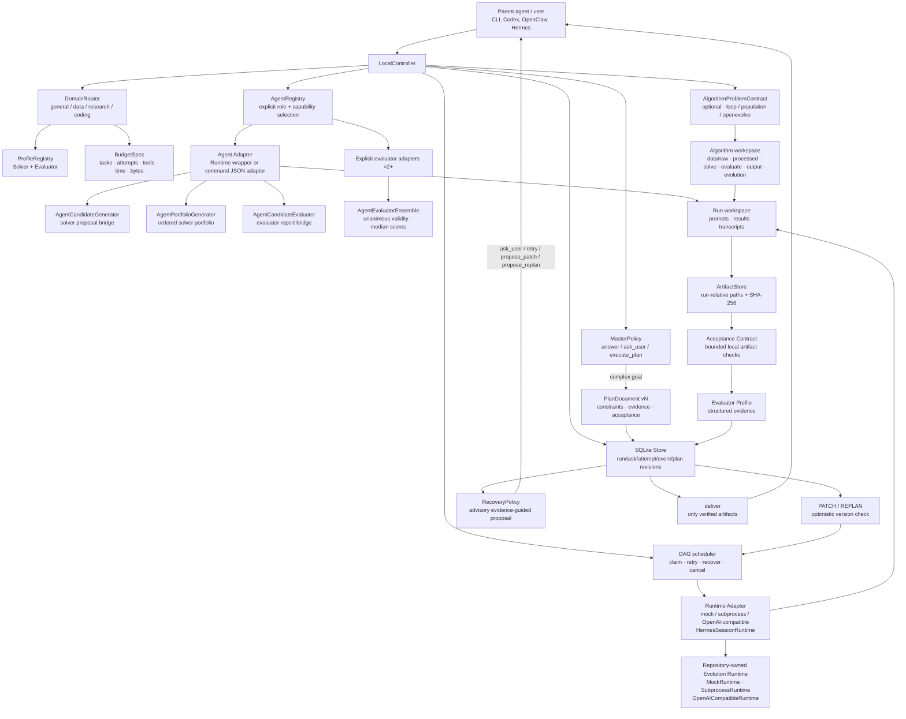

# Lunar-Agent architecture

Lunar-Agent keeps the useful *effect layer* ideas from WebAgent v2.5 while remaining a single
local process and an installable CLI. The model runtime is an adapter: Hermes-style sessions,
OpenAI-compatible endpoints, a subprocess agent, and the deterministic mock runtime all use the
same controller and ledger contracts.



The ordinary task runtime and the evolution runtime share the repository-owned adapter boundary.
For an evolution run, `--agent-runtime` constructs a fresh runtime-backed Agent adapter for each
unbound role and sends it through the existing strict candidate-generation/evaluation bridges:

```text
Repository-owned runtime profile
├── MockRuntime
├── SubprocessRuntime (explicit command)
└── OpenAICompatibleRuntime (explicit endpoint/model)
        ↓
RuntimeAgentAdapter (one fresh instance per role)
        ↓
AgentCandidateGenerator / AgentCandidateEvaluator
        ↓
loop or population strategy → canonical candidate archive
```

This profile is the internal Agent skeleton for standalone Lunar-Agent use. It is intentionally small,
local, and dependency-free at the protocol boundary; no Hermes/OpenCode/Codex/Claude Code/DeepSeek
Harness process is required. A subprocess runtime or OpenAI-compatible server may still be backed
by any of those tools when the owner explicitly supplies the command or endpoint.

## Control flow

1. `decide` applies the smallest-useful-action policy. Explanations return `answer` without a
   durable run. Underspecified goals return bounded `ask_user` questions. Multi-step goals produce
   a validated version-1 plan.
2. `plan` atomically writes the run, plan revision, logical task IDs, and policy decision. The
   store maps logical IDs (for example `research`) to run-scoped physical scheduler IDs, so plan
   documents remain readable without changing the legacy task primary key.
3. On creation, the deterministic Domain Router classifies every executable run as `general`,
   `data`, `research`, or `coding`, records its evidence, and selects runtime-neutral Solver and
   Evaluator Profiles. The default profiles preserve the existing non-empty result evaluation;
   callers may inject a stronger evaluator without changing a Runtime Adapter.
4. A plan may additionally carry an `algorithm_problem` contract. It is validated before durable
   execution, stored in the immutable plan revision, and materializes six fixed local role
   directories plus a digest-bearing `algorithm-workspace.json`. The strategy layer consumes this
 contract through one runtime-neutral seam: `loop` is the default, `population` is a bounded local
 search, and `openevolve` is an explicitly configured local subprocess.
5. A caller may use `delegate`/`LocalController.run_agent` for a role-bearing worker. The explicit
   `AgentRegistry` selects only registered adapters satisfying every requested capability. A
   `RuntimeAgentAdapter` preserves the existing Runtime contract; `CommandAgentAdapter` invokes an
   absolute executable with one bounded JSON stdin/stdout exchange. No adapter is discovered from
   PATH or global Agent state.
6. The controller schedules ready DAG nodes. Each attempt writes a prompt and result artifact;
dependent nodes receive only verified predecessor artifacts and bounded previews. Runtime
adapters never own durable state. The selected evaluator profile establishes a base decision, then
an optional declarative acceptance contract independently checks result text and regular artifacts
only beneath that attempt workspace. Contracts can require file existence, artifact text, JSON
parsing/top-level keys, and `all`/`any` composition; they never execute commands, invoke a model,
or inspect an escaping path. Both decisions persist as a bounded structured evidence tree. A
retry preserves the task and plan contract and appends a bounded, task-scoped projection of the
latest failed evaluation (or generic runtime-failure guidance) to the next attempt prompt; raw
errors and result contents stay in their original ledger/artifact records.
per-run budget bounds task count, attempts, agent tool calls, elapsed controller time, and indexed
artifact bytes. Crossing a limit emits `budget_exceeded`, fails closed, and keeps existing artifacts
inspectable.
7. A failed or newly-informed run can receive `patch` or `replan` while idle. SQLite checks the
   current `(plan_id, version)` before applying a typed patch. Prior revisions stay immutable;
   not-yet-run tasks removed by a revision become `superseded`, while completed task definitions
   cannot be changed.
8. `recover` is a deterministic, advisory local policy over persisted task/evaluation/input/budget
   evidence. It returns `retry`, `ask_user`, `propose_patch`, `propose_replan`, `stop`, or `none`,
   writes each distinct proposal as a hashed audit artifact and idempotent event, and exposes the
   latest proposal in status JSON. It does not invoke a Runtime Adapter or model, execute a tool,
   mutate tasks, resume work, relax budgets, or apply a plan revision; a parent/user must choose an
   existing explicit command after reviewing the evidence.
9. `deliver` is a fail-closed decision. It requires a succeeded run, passing evaluator events for
   every succeeded task, and at least one indexed result/runtime artifact with a SHA-256 digest.

## Deliberate boundary versus WebAgent

The WebAgent branches demonstrated that Master routing, explicit clarification, solve/evaluate
separation, schema-driven artifacts, patch/replan lifecycle, and experience/memory capture improve
long-running work. Lunar-Agent makes the separation concrete with a restricted local acceptance
contract interpreter instead of accepting a Worker completion claim. The branches also contain
service concerns (HTTP/SSE, queues, cloud sandboxes, multi-tenancy, billing) and an OpenCode-specific
process model. Lunar-Agent adopts the portable behaviors and excludes those deployment assumptions.
A parent agent can invoke the JSON CLI as a child process, while a local user can run the same
binary without a Hermes installation or a machine-wide configuration directory.

## Invocation and evolution seams

The invocation seam and the search-strategy seam are deliberately independent:

| Seam | Supported forms | Durable authority |
| --- | --- | --- |
| Invocation | direct local CLI; `delegate` with an explicit Agent command; parent-Agent child process with `--json`; detached handle followed by `resume` | SQLite run/plan ledger and run workspace |
| Evolution | `loop` (default); `population` (opt-in); Agent-backed generation; Agent-backed evaluation; `openevolve` (optional local command) | shared problem contract, candidate archive, validity-first report, and relative result handoff |

In direct mode, the owner supplies the goal and observes the result. In child-process mode, a
parent such as Codex, Hermes, or OpenClaw supplies stdin/arguments and consumes bounded JSON
stdout; it does not become a required runtime dependency. In detached mode, the caller receives a
run ID before work finishes and can safely terminate; a later process reconstructs the same plan
revision, contract manifest, retries, and artifacts with `resume`.

`famou evolve CONTRACT` is the CLI/controller entry point for this seam. It creates one ordinary
SQLite run with an evolution task, copies the contract to `evolution/contract.json`, and records
`evolution_started`, `evolution_iteration`, `evolution_candidate_archived`, and
`evolution_finished` events. `--detach` returns the run ID before execution; `--resume --run-id`
re-enters the same task after a process exit. The strategy itself still owns only the local
archive/state files, while SQLite owns task lifecycle, cancellation, and the final run status.
Native command-backed runs add credential-safe generator and evaluator adapter fingerprints to the
strategy config. Resume compares those fingerprints before task claim, preventing a solver command,
evaluator command, Agent role, name, or capability change from silently extending an old archive.
Only canonical SHA-256 values are persisted; raw command arguments and credentials are not copied
into state.

`loop` and `population` are implemented as library strategies over the same append-only archive.
Each loop round receives a fresh generation request and returns best-so-far from all valid history;
population maintains bounded active IDs, objective-aware score/novelty selection, optional islands,
and ring migration while retaining the full archive. `AgentCandidateGenerator` adapts an explicit
role-bearing solver Agent to the generation seam, while `AgentCandidateEvaluator` adapts a separate
evaluator Agent that must return one strict JSON `EvaluationReport`. The report is parsed and
validated by Lunar-Agent before validity-first selection; evaluator prose, status claims, and
malformed JSON are never accepted as evidence. The solver and evaluator may be different commands
and roles, and both remain optional adapters rather than required runtime dependencies. For
higher-assurance runs, `AgentEvaluatorEnsemble` composes two or more explicit evaluator adapters:
each member receives the same candidate and contract through an isolated workspace, validity must
be unanimous, and valid numeric evidence is aggregated with a median. A member failure, malformed
report, or validity disagreement produces an invalid aggregate report.
`openevolve` is only an adapter: it receives an explicit executable and a generated config, then
imports a validated result into Lunar-Agent's canonical archive. The existing `--workers` pool is
scheduler parallelism for independent DAG tasks and must not be interpreted as a candidate
population.

The `--agent-runtime` evolution profile is mutually exclusive with OpenEvolve and is allowed to
fill either or both missing native seams. Explicit generator/solver and evaluator adapters remain
available for mixed configurations. When both seams are already explicit, a runtime option is
rejected rather than silently ignored. Runtime provenance is recorded as credential-safe digests;
detached children receive secrets only through `FAMOU_AGENT_RUNTIME_API_KEY`.

For Agent-backed generation, the bridge projects bounded `evaluation_feedback` from prior validated
reports into the next prompt. This lets a solver address constraint failures and weak metrics while
keeping candidate source, prompts, logs, and raw adapter errors out of the context. Feedback is
read-only evidence; it cannot alter evaluator validity or population ranking.

Population runs may use `AgentPortfolioGenerator`, which rotates two or more explicitly registered
solver adapters in deterministic round-robin order. The portfolio is a composition over the same
generation bridge, not a new strategy or service: each member receives a unique run-scoped request
workspace, and the ordered command/profile digest is checked on resume. Evaluator portfolios use a
separate `AgentEvaluatorEnsemble`; evaluator workspaces are likewise isolated and the ordered
evaluator command/profile digest is checked on resume.

Every strategy result includes `best_candidate_path` when validity-first selection found a regular
candidate source below the run workspace. The controller writes the same additive field to
`evolution/result.json`, the `evolution_finished` event, and `status --json`; parent Agents can join
it with the returned workspace path without depending on archive internals. A missing, escaping, or
symlinked source is treated as unavailable and never handed off as a best artifact.

## Recovery and migration

SQLite uses WAL mode. The controller recovers an interrupted `running` task as `uncertain`, then
replays it through the normal retry/evaluation path. Plan revisions are keyed by `(run_id, version)`
so the same plan template may be used by multiple runs; an additive migration upgrades the initial
feature-006 table and retains all documents. Feature 007 uses additive nullable route/profile
 columns plus JSON budget/evidence fields, so old runs still load with default limits. The run
 workspace is the artifact boundary and can be
inspected after the process exits.
