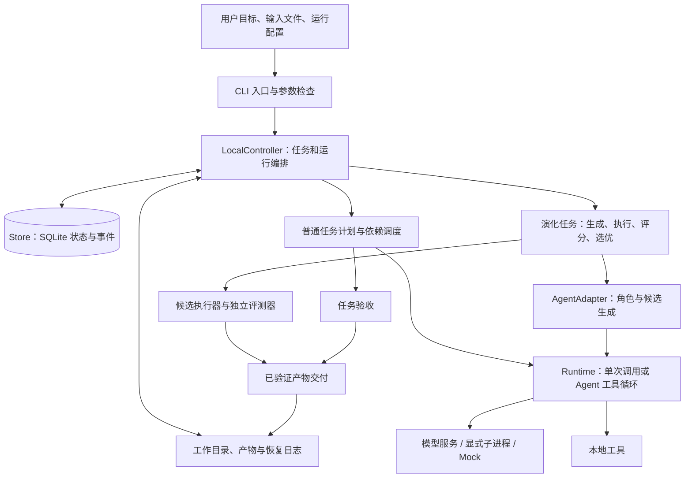
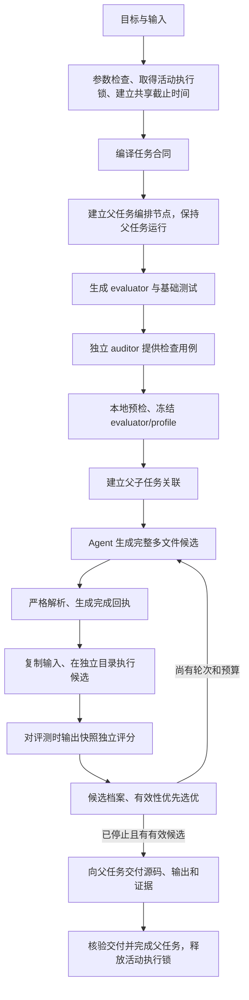

# Lunar Evolution：当前架构与执行链路

创建日期：2026-09-20；2026-09-21 更新包含 Feature 142 Phase C 与已完成本地验收的 143 修复。
142 Phase A/B 的已推送历史基线为 `65d9ae2`。Phase C 自动多文件后台入口现已实现，真实
本机子进程与回环 HTTP 夹具已通过；本次完整三阶段回归已通过，不代表当前版本已通过 Linux。
Feature 143 已补本地 worker 的并发隔离、精确进程清理与 owner 活性恢复；T009 实际 consumer 仍待接入。
下文分别说明已经实现的路径和仍待验收的边界。

## 1. 系统定位

Lunar 是一个本地运行、持久保存状态的 Agent 执行系统，并带有原生程序演化引擎。它已经能把自然语言任务转成结构化合同，调用模型和工具生成产物，运行候选程序，独立检查结果，并把可核验的文件交给父任务。

系统目前是 **Python 模块化单体 + SQLite + 本地工作目录 + 受控子进程**。`lunar-evolution` 是唯一安装的控制台命令，`python -m lunar_evolution` 是等价模块入口；两者都进入 `src/lunar_evolution/cli.py`。Python 包名为 `lunar_evolution`。当前不依赖独立部署的调度服务、消息队列或全局 Hermes 环境。

这里有两种不同的循环：`AgentLoopRuntime` 是模型调用工具、读取反馈、继续工作的循环；`PopulationStrategy` 是生成多个程序、执行评分、选优再生成的演化循环。旧的 `LoopStrategy` 演化策略已经退役，不能和仍在使用的 Agent 工具循环混淆。

当前主要演化对象是任务的候选程序与解法。搜索会改变候选源码和候选集合，不会自动修改 Lunar 控制器本身，也不是在线训练模型权重。

| 运行方式 | 模型主要做什么 | 系统额外做什么 |
| --- | --- | --- |
| 普通 Agent 任务 | 根据计划工作，可调用工具完成当前任务 | 管理任务依赖、保存结果、按验收规则检查 |
| 原生演化任务 | 生成候选和改进候选，可在每次生成中使用工具 | 维护种群，运行程序，独立评分，选择和迭代 |
| 外部 producer | 由外部框架搜索并提交候选 | Lunar 对接收材料重新准入、评测和登记 |

因此“允许更多工具步骤”和“进行更多演化轮次”是两项不同的预算。前者帮助一次生成完成，后者扩大被验证的候选搜索范围。

## 2. 总体结构



普通任务调度直接通过 `Runtime` 协议调用运行时；显式角色委派及演化生成另有 `AgentAdapter` 通道。二者共用 Controller/Store 的状态管理。源码中没有独立的 scheduler 服务；调度循环在 `LocalController.resume()`，依赖推进和任务领取在 Store。

| 层 | 当前职责 | 主要实现 |
| --- | --- | --- |
| 入口与编排 | 命令、模式校验、输入导入、继续运行、普通/演化分流 | `cli.py` |
| 控制层 | 创建/领取任务、并发、预算检查、结果登记、取消、父子交付 | `controller.py` |
| 自动求解生命周期 | 活动执行排他、后台所有权交接、共享截止时间、阶段检查、父任务编排、状态投影 | `automatic_solve_lifecycle.py`、`automatic_solve_worker.py`、`cli.py`、`controller.py` |
| 显式 worker 控制面 | 独立 attempt 执行、owner 活性锁、等待、原子消息续跑、精确进程清理及结果持久化 | `workers.py`、`worker_ownership.py`、`store.py` |
| 状态层 | run/task/attempt、事件、产物索引、计划版本、进程归属 | `store.py`、`models.py` |
| 计划与角色 | 任务合同、依赖图、领域与能力选择、恢复建议 | `conversational.py`、`algorithm.py`、`policy.py`、`routing.py`、`profiles.py`、`recovery.py` |
| 模型与工具 | Mock、显式进程、兼容接口；工具循环、请求预算、会话 | `runtime.py`、`agents.py`、`agent_loop.py`、`tools.py`、`model_profile.py` |
| 演化搜索 | 种群、候选档案、生成与评估接口、选优与停止 | `evolution.py`、`agent_evolution.py` |
| 多文件程序 | 源码包、执行计划、输入、执行记录、评分快照、交付 | `candidate_*.py`、`bundle_*.py`、`automatic_solve_bundle.py` |
| 外部生产者 | 将外部候选转换成可由 Lunar 重新核验的输入 | `openevolve_handoff.py`、`shinka_handoff.py`、`producer_handoff.py`、`seed_handoff.py` |
| 验收工具 | 固定任务和预算、监控真实请求、只读检查与报告 | `specs/*/measurement/`，不属于日常产品运行的必经层 |

Feature 143 增加了一条与普通 task DAG 分开的显式 worker 链路：Controller 通过
`dispatch_worker/send_worker/list_workers/wait_worker/cancel_worker/resume_worker` 操作稳定的
worker identity，Store 保存 worker、attempt 和受限事件。worker 的 activity phase 与最近一次
outcome 分开记录；直接 owner 才能操作，父取消会传播到已验证的子树。显式恢复只将已确认
owner 中断且完成进程清理的未完成 attempt 标记为 `lost`，缺少 owner/锁证据的记录保持原状。
结果默认内联截断，大结果写入 worker attempt 目录并由带 SHA-256 的引用读取。

这条链路尚未接入 CLI `delegate` 或 AgentLoop 的工具。2026-09-21 审计发现的共享取消、
误判中断和排队取消缺陷已补修复：每个 attempt 由 factory 创建独立 adapter/runtime，
执行前核对 Store 状态，回调与关闭绑定精确 attempt，实际 PID/PGID 由 observer 登记和清理。
Store migration 8 增加可空 service owner 和独立进程表；服务持有本地锁证明活性，打开第二个
服务不触发全库恢复。`send` 消息到显式 resume 时与启动认领原子消费，后来消息留到下次。
修复共享回归 260 项通过，完整验证见 [143 validation](../specs/143-local-worker-lifecycle/validation.md)。
普通 DAG 的独立 runtime 并发与这里的 worker session 仍是不同路径。
这条链路复用现有 AgentAdapter，但尚未迁移普通 delegation，也没有改变 task DAG 或自动多文件
入口的生命周期。

## 3. 普通任务怎样执行

最常用的对话入口是 `solve`。没有启用演化时，执行顺序为：

1. 检查参数，创建父 run，将输入复制到 run 的 `data/raw` 并登记大小和 SHA-256；每个 attempt 执行前再核验并复制到自己的目录。
2. `RuntimeContractCompiler` 把目标转换为 `AlgorithmProblemContract`，明确输入、输出、约束和目标。如果关键信息不足，保存问题并进入 `awaiting_input`。
3. 根据合同创建默认依赖图：`data_discovery → formulate → solve → verify`。显式 `--role-dag` 使用更细的角色计划；角色不意味着系统自动配置了多家模型。
4. Controller 从 Store 领取依赖已满足的任务。默认一个 worker，配置并发后以独立运行时执行可并行任务。
5. Runtime 获得任务提示和工作目录。启用 Agent loop 后，模型可反复读文件、写文件、查看目录、询问用户；命令执行和记忆是显式能力选项。
6. 保存结果、会话和文件，运行当前任务的验收规则，再推进依赖或记录失败。允许的普通重试受配置限制。
7. 全部必需任务和产物满足条件后，由 Controller/Store 确定终态，用户可查看状态、事件和交付文件。

`run` 更直接地执行给定任务/计划，默认不会像 `solve` 那样先编译合同；`delegate` 通过角色能力注册表调用 Agent。普通对话任务在合同尚未生成时应走 `solve --resume --run-id` 或 `answer`，不能把裸 `resume` 当成所有合同编译场景的通用恢复入口。

普通任务的默认验收不是通用语义判题器：默认各领域 evaluator 都使用非空结果检查，显式 acceptance、角色证据、输出结构检查再增加约束，复杂问题仍需要合适的评测合同。普通 DAG 的前驱产物传递也没有像多文件执行证据链那样逐份重算所有前驱文件的指纹。

`MasterPolicy` 和 `DomainRouter` 当前是确定性的规则实现。`solve` 的合同来自模型，但默认任务图由程序构建；不能把当前系统描述成由一个大模型总管自由生成并管理任意 Agent 团队。合同编译优先走单轮 `run_isolated()`，不用候选生成时的工具循环、记忆或会话历史。

## 4. 原生自动多文件演化怎样执行

入口为 `solve --evolve --multi-file`。当前只接原生 population 策略，自动准备 evaluator；
外部 producer 尚未接入。新生命周期任务已支持 `--detach`，以及 `solve --resume --detach`、
`resume --detach`、`answer --detach`，前后台进入同一自动执行路径。



这条链分成准备与搜索两段。准备通过后才创建和运行候选；搜索期间使用同一份冻结评测器。候选生成时，模型写过文件不代表候选已经完成：最终结构必须被解析器接受，并产生绑定 run、task、budget、candidate 和源码摘要的持久记录。

自动入口的具体调用关系是：

```text
CLI solve / resume / answer
  → 可选后台启动：继承执行锁 → 登记 PID/PGID → 放行本地 worker
  → 自动活动执行入口：排他锁、SolveExecutionControl、父编排任务
  → 合同编译 → prepare_automatic_solve_bundle → evaluator compiler / auditor / probes
  → LocalController.run_evolution → EvolutionContext → PopulationStrategy
  → AgentCandidateGenerator → AgentAdapter → AgentLoopRuntime → 模型 / 工具
  → MultiFileCandidatePipeline.persist
      → source bundle / workspace plan / input staging / execution admission
      → run_candidate_execution_recorded → CandidateExecutionRunner → 独立进程组
      → evaluate_candidate_execution → 评测时文件快照 → 独立 evaluator 进程组
      → CandidateArchive → 有效性优先选择
  → 父交付包核验 → 输出发布 → 父任务终态
```

`EvolutionContext` 把生成器、评测器、取消判断、剩余时间和事件观察统一交给演化策略。
`MultiFileCandidatePipeline` 管理一个候选的执行与评分，不负责整个 run 的成功判定。
原生子任务找到最优候选后，Controller 还必须完成父任务交付；因此候选成功、子任务成功和
用户最终拿到已核验产物是三个不同的检查点。

多文件候选经过源码包检查、工作目录与执行计划绑定、输入登记、候选程序执行、输出检查、独立 evaluator 运行，再进入候选档案。排名先看有效性，再看目标分数；配置启用时还包含种群多样性和岛间迁移等搜索控制。模型和外部生产者自报的分数都不能直接代替 Lunar 的最终评分。

多文件交付复制完整源码、输入与已评分输出快照、合同和评价材料，并以摘要关联原执行证据。绑定原工作区 inode 的 launch-intent/result/completed 记录保留在原处，不会搬到父交付包中。评测快照是在成功执行之后、独立评分时采集的，不是进程退出瞬间的输出证明。

该路径不再重跑被选中的候选来“证明”交付。旧单文件演化的 materialization 路径可能再次执行选中程序以生成最终输出，不能把两种交付语义混在一起。

所谓独立评测，是生成器、执行器和评分器职责分开、评分依赖实际文件；compiler 和 auditor 仍可能使用同一模型服务。auditor 看得到 evaluator 源码，但看不到 compiler 的自测探针；solver 不接收 evaluator 实现和两组探针。它提高可检查性，不保证生成的 evaluator 对任意新任务都正确。预检、审计用例和真实留出测试用于进一步验证它；真实 holdout 属于独立验收工具，不是每次日常 solve 默认必跑的阶段。

## 5. 状态、文件和恢复如何衔接

| 对象 | 含义与作用 |
| --- | --- |
| `Run` | 一次持久任务，记录整体状态、工作目录、计划、预算和后台进程 |
| `Task` | run 内可调度的工作单元，带依赖、验收规则、输入问题和结果路径 |
| `Attempt` | 一个 task 的一次执行，记录运行时、进程、开始/结束和错误 |
| `Worker / WorkerAttempt` | 显式本地 Agent 会话及一次执行，与 task 依赖图分开管理 |
| 自动 `execution_id` | 一次前台或后台活动执行的身份；共享截止时间不跨人工等待累计 |
| `PlanDocument` | 有版本的任务图和问题合同，调整计划需留下版本与事件 |
| `Artifact` | 产物文件的路径、大小、内容摘要和归属 |
| `Candidate / Receipt` | 候选源码与生成、执行、评价身份的绑定关系 |
| `CandidateArchive` | 候选、评分、状态与演化结果的持久档案 |
| 发布日志 | 在文件发布与数据库登记之间留下可核验的阶段，支持有条件恢复 |

默认状态目录为 `.lunar-evolution`；可通过 `LUNAR_EVOLUTION_HOME` 配置，显式 `--home` 优先。包、CLI、用户配置和历史兼容边界见 [Feature 145](../specs/145-lunar-evolution-identity/spec.md)，原始测量见[历史归档](history-archive.md)。`state.db` 使用 SQLite WAL，保存调度权威与事件；大块源码、输入、输出、模型会话和执行证据放在工作目录。

任务的 `waiting` 可以表示等前驱依赖，也可以表示等用户；只有带真实非空问题的任务才对应用户待答。`answer` 把答案保存为产物并恢复原 run/task，不会把依赖等待误当作用户问题。

在演化执行与交付证据链中，恢复先检查登记状态、文件与摘要，区分可以继续、已经完成、明确失败和无法判断。原生候选/多文件路径的完整终态可以只读复用；OpenEvolve 的完成状态恢复则会重新本地准入和评分已有源码，但不重启外部 producer。发布中断可按日志补齐已经授权的登记；无法判断是否执行过的现场不会仅凭目录里出现文件就自动重跑。历史单文件流程的手动 attestation 是专门的异常恢复入口，不是正常多文件求解每一步都要求用户填写的手续。

普通任务另有自己的恢复语义：中断的 running task 会被标记为 uncertain，显式恢复可能再次调用 runtime。因此不能对所有普通工具副作用承诺“恰好执行一次”。`recover` 命令生成持久建议，`resume` 才执行恢复；两者职责不同。

公开 `status` 和底层 `run_status` 仍可能不同，例如 preparation 的可恢复失败会保留可继续的
持久父状态。CLI 会结合 preparation、child 和 delivery 投影有效状态。Feature 142 已为新自动
任务增加持久编排节点：父任务在 preparation、child 搜索和 delivery 期间保持运行，只有核验
交付后才成功。旧任务保持历史恢复语义，不会自动补写新生命周期标记。

后台启动返回原父任务 ID、当前状态与 `detached: true`、`launch_status: accepted`。接受启动
与执行结果分开表达：若上次 preparation 可恢复失败仍是最近诊断，返回值保留该事实；已接受
且父任务非终态的启动以成功退出码返回。答案先在同一执行锁下接受一次，启动失败保留答案，
由用户显式续跑。终态及仍待用户回答的 resume 不创建后台进程。

## 6. 预算与取消的当前边界

当前已经有多层预算：普通 Controller 活动执行时间、运行时单次超时、模型 profile 的调用限制、Agent 工具次数、每候选显式工具预算、preparation 单次请求与总时长、自动 solve 活动执行总时限，以及产物大小等限制。

普通 Controller 的活动预算从每次 `resume()` / `run_agent()` 开始计时，不是跨合同编译、用户等待和多次恢复累积的持久总时限。Feature 142 已实现的 `--solve-wall-timeout` 也限制一次活动执行；人工答复后的新执行沿用原策略，但已观察到总预算耗尽的终态不能靠 resume 补时。

普通 `run --detach` 和普通 `solve --detach` 保留原有后台路径。自动多文件后台启动由
`automatic_solve_worker.py` 复用已有执行锁：父进程持锁登记后才放行子进程，子进程取得执行权
后开始活动预算，并在退出时仅清除自己的 PID/PGID。到达 `awaiting_input` 后进程退出；
恢复必须先确认旧协调进程退出、清理已登记工作，不能仅凭锁空闲就替换仍活着的执行者。

新自动多文件任务已由同一个单调时钟截止时间贯穿“合同 → 准备 → 全部候选 → 评分 → 父任务
交付”。每个阶段只能取得原上限与剩余时间的较小值，不能重置总时限。策略、输入、评测器和
候选身份保持固定；实际收窄的 timeout 属于运行控制。省略 solve 选项不会自动增加 50 分钟默认值。

Phase B 已完成父 run 到已验证 child 的停止传播、candidate/evaluator/probe 的实际 PID/PGID
登记、拥有者释放、失败清理和取消/截止时间竞态保护。清理失败会保留未释放登记并终止当前
活动阶段，避免新进程覆盖旧拥有者；清理顺序先处理候选/评测等工作组，再处理协调进程。
这些结论来自本地 fixture 和进程组回归，不代表远端 provider 已停止计算。Phase C 已通过
本机真实子进程验收，覆盖前后台交付一致性、等待输入退出、取消独立候选进程组、异常退出恢复
和并发续跑争用；完整回归也已通过，精确结果见 142 validation。Feature 143 的 worker 隔离与恢复缺陷已修复，其
T009 consumer 尚未接入；它没有成为这条流程的后台执行器，142 不依赖该迁移。

Feature 139 的 50 分钟属于历史真实验收的外层监控预算，该槽已结束。新产品可以明确设置
`--solve-wall-timeout 3000`。新的真实验收仍使用新登记和目录，区分产品活动预算与验收监督预算。
本地取消也不能证明远端模型服务已经停止计算。

“隔离执行”目前主要是独立本地工作目录、受限环境、进程组、路径和文件规则；不能把它描述为已经部署了容器或完整操作系统沙箱。

## 7. OpenEvolve / Shinka 在哪里接入

融合思路是让外部框架提供候选，Lunar 继续负责任务合同、输入、实际执行、独立验收、状态和交付。共同边界是 producer result、seed manifest、身份和本地证据检查，不是把外部框架的运行状态当作 Lunar 成功。

| 路径 | 当前实现情况 | 尚缺部分 |
| --- | --- | --- |
| 原生 population | 可运行；多文件生成、执行、评分和父任务交付已通过原生离线完整流程 | 当前模型真实闭环验收及更广任务覆盖 |
| OpenEvolve | 有显式本地子进程策略与 handoff 接口，有离线协议验证 | 当前自动多文件 seed 接线、真实框架效果验收 |
| ShinkaEvolve | 有已完成结果的只读导出与通用 producer/seed 转换 | 直接启动调度、自动多文件接入、真实效果验收 |
| 远端 producer/material | 有协议、身份和已完成材料的接入边界 | 不能据此视为通用远端计算集群或多文件全链路已完成 |

当前多文件 pipeline 与 `seed_manifest` 同时使用会被明确拒绝，这也是外部多文件接入的实际代码缺口。当前支持范围内的独立源码约束是 `python_file_count`；它能核验源码文件数量，不能证明 helper 确实被调用、某个依赖确实使用或程序满足任意执行行为要求。超出支持范围的 source/execution 约束会提前拒绝。

## 8. 架构评估与下一步

当前最有价值的基础是：状态不依赖模型记忆，产物可定位，生成、执行和评分有独立记录，外部候选可以沿同一套核验流程接入。这些基础让失败诊断和后续接入新生成器有实际落点。

主要负担在编排层。`cli.py`、`controller.py`、`evolution.py` 已承担很多入口、兼容和状态转换职责；普通、单文件演化、多文件演化各自形成了生命周期分支。自动多文件的时间、父编排、本地取消和进程清理已经统一；Phase C 将后台所有权交接放入独立 worker 模块，后续抽取编排模块应以这些验收覆盖为基础。

建议按以下顺序继续，不把大重构作为可用性的前置条件：

1. Phase C 当前代码的完整三阶段回归和独立复核已经通过；提交后验证当前 Linux CI。历史版本 `8e1e089` 的跨平台结果不代替本轮验收，详见[系统评估](system-readiness-20260916.md)。
2. 补齐新的 50 分钟真实验收实现、登记与启动前检查；候选最终响应可靠性改动须先有明确规格并离线验证，不能运行中修代码。
3. 在 143 已修复的独立 worker 生命周期上迁移一个实际 delegation consumer；T009 不阻塞 142 生命周期实现和前台验收。
4. 后续将 OpenEvolve/Shinka 的多文件候选接到现有流水线，逐个做有界真实验收，再扩展复杂输入、跨文件依赖、执行方式和通用仓库任务；用代表性任务验证能力。

## 9. 阅读源码的入口

- [CLI](../src/lunar_evolution/cli.py)：`_solve`、`_solve_evolution`、`_solve_payload`、`_status_projection`。
- [Controller](../src/lunar_evolution/controller.py)：`resume_conversational`、`resume`、`_execute_task`、`run_agent`、`run_evolution`、`cancel`。
- [自动准备](../src/lunar_evolution/automatic_solve_bundle.py)：`prepare_automatic_solve_bundle`。
- [评测器编译与审查](../src/lunar_evolution/evaluator_bundle.py)：`compile_evaluator_bundle`、`_compile_audit_suite`、`load_evaluator_bundle`。
- [多文件候选生成](../src/lunar_evolution/agent_bundle_generation.py)：`generate_bundle_candidate`、`parse_bundle_agent_draft`。
- [多文件执行与评测管线](../src/lunar_evolution/bundle_evolution.py)：`MultiFileCandidatePipeline`。
- [演化引擎](../src/lunar_evolution/evolution.py)：`CandidateArchive`、`PopulationStrategy`、`OpenEvolveStrategy`。
- [独立候选评分](../src/lunar_evolution/candidate_evaluation.py)：`evaluate_candidate_execution`、`inspect_candidate_evaluation`。
- [父任务交付](../src/lunar_evolution/bundle_parent_delivery.py)：`finish_bundle_parent_delivery`、`inspect_bundle_parent_delivery`。
- [自动生命周期](../src/lunar_evolution/automatic_solve_lifecycle.py)：`SolveExecutionControl`、`own_automatic_solve` 和状态投影。
- [自动后台协调进程](../src/lunar_evolution/automatic_solve_worker.py)：锁交接、登记放行、退出清理与显式恢复。
- [显式 worker](../src/lunar_evolution/workers.py)：worker 会话、消息、等待、取消及重启处理。
- [Feature 142 规格](../specs/142-automatic-solve-lifecycle/spec.md)：Phase A/B 已验收；Phase C 已实现并通过本机夹具，完整回归已通过。

本文区分源码已实现、离线验收、真实运行和规划四种状态。当前真实运行结果由 Feature 139 的独立报告记录，架构存在一条执行路径并不自动意味着该路径对所有真实模型任务都已成功。
