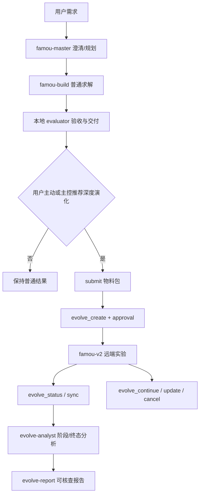

# WebAgent 2.5 与 famou-v2 的融合架构（固定提交）

审查提交：`f6ad20caf8963d105fe26c96b6a30ef4dfd34859`（`origin/famou-v2.5/base`）

## 结论

WebAgent 2.5 不是把 famou-v2 当作一个本地 subagent，也不是把演化循环嵌入普通求解循环。它采用“本地主控 + 远端演化控制面”的两层结构：WebAgent 负责理解需求、澄清、规划、委派普通求解、交付结果和决定是否进入深度演化；famou-v2 负责一次独立实验的初始化、候选生成、评估、选择、种群状态和迭代。

融合发生在物料和事件边界，不发生在模型运行时边界。

## 一次完整链路

### 1. 普通求解先独立完成

`famou-master` 先走字段扫描、澄清、规划，再派普通求解和 evaluator。新版明确要求先交付普通结果，再进入深度演化；深度演化不是普通 Build 的隐式重试。

普通结果成为演化的输入物料，但不是直接把一个运行中的 worker 转交给 famou-v2。

### 2. 提交前构造实验物料

`famou-evolve-experiment-submit` 在本地创建新的 `submit/` 目录，准备并检查：

- `init.py`：初始程序/候选入口；
- `evaluator.py`：必须能独立调用并返回 `validity`、`combined_score`、`error_info`；
- `prompt.md`：任务、接口、目标、约束、禁止事项；
- `config.yaml`：`evolve_config`、`initial_program`、`evaluator`、`system_message`；
- 数据和配置引用的其他文件。

它还做静态编译、导入/签名检查、路径与工作目录检查；较新的完整 skill 还要求先实际执行初始程序并确认 `validity == 1`。这一步把普通求解结果转换成一个可独立复现实验，而不是把对话上下文传给远端。

### 3. `evolve_create` 只提交，不承载演化逻辑

`evolve_create` 是唯一创建入口，并设置 180 秒本地 CLI 调用上限。它通过 `FamouClient` 读取 `/root/.config/opencode/tool-url/famou-v2`，再调用外部 `famou-ctl experiment create`。创建返回的是 opaque `experiment_id`；WebAgent 不等待本地 worker，因为远端实验不属于本地 worker registry。

V2.5 的完整版本给 `evolve_create` 增加了 approval card 中的 `max_iterations` 与 `gpu` 摘要，并对 `ok:false` 做结果适配，避免失败被误记成 approval 成功。当前提交前一致性校验函数仍处于注释状态，因此不能宣称它已经强制验证 config 与 approval card 一致。

### 4. 之后全部按实验 ID做远端控制

- `evolve_status/list`：只读查询；
- `evolve_sync`：把远端实验目录同步到当前工作目录的 `./<experiment_id>`；
- `evolve_continue`：对已有种群追加迭代；
- `evolve_update`：运行中更新允许的配置；
- `evolve_cancel`：二次确认后终止，不删除实验数据。

每个工具都只执行一次，不自动重试不确定的创建/继续/取消。超时、无 ID、服务不可用都会落成 `unknown`，后续通过 status 对账，而不是重新 create。

### 5. 事件处理与报告是另一层

创建成功、初始化失败、阶段摘要和终态事件有不同处理路径。阶段/终态交给 `evolve-analyst` 只读分析，写入实验目录的 `analysis/`；实验完成后再由 `famou-evolve-report` 从同步目录和分析报告生成一份可核查 HTML。分析和报告不修改 evaluator、候选源码或远端种群。

## WebAgent 借鉴的关键设计

1. **物料包优先**：先把程序、评估器、任务契约和数据组成自洽目录，再创建实验。
2. **普通求解与深度演化解耦**：Build 先交付；演化是显式后续动作，不是失败重试。
3. **控制面与执行面分离**：本地只维护实验 ID、状态和同步目录；远端维护真实种群和迭代。
4. **结果适配器**：工具失败必须返回结构化 `ok:false`，不能因为“没有抛异常”而被当成成功。
5. **不确定结果不重试创建**：创建属于有副作用的动作，unknown 必须 status 对账。
6. **评估器冻结、分析只读**：演化过程可以改候选，不能为了分数修改 evaluator；分析不能篡改实验事实。
7. **完成后再做可核查报告**：报告以同步后的实验物料为唯一事实来源。

## 不应直接照搬的部分

- 不把 `FamouClient` 或 `CommandAgentAdapter` 塞进 Lunar 的 staged Master→Build。两者的 worker、账本、checkpoint 和 receipt 契约不同。
- 不把远端 `combined_score` 当 Lunar score。同步回来的候选必须经过 Lunar 本地 exact harness 和本地 receipt。
- 不把创建工具的 180 秒、status 的 300 秒启动轮询当作远端实验全局期限。
- 不把当前注释掉的 config 一致性校验写成已验证能力。
- 不把远端 `experiment_id` 当候选身份；候选仍需本地 source/lineage/contract identity。

## 对 Lunar 的直接映射

Lunar 应复制 WebAgent 的“融合位置”，而不是复制它的远端实现：

1. **Master→Build 完成后**，从已有 Build 结果、exact harness、任务契约和输入数据生成一个只读 submission bundle，并保存本地 receipt/fingerprint。
2. **显式 opt-in 后**，由独立 evolution broker 负责 `submit/status/sync/continue/cancel`；默认 staged 和 local evolve 不实例化 broker。
3. **同步回来后**，把远端程序当 untrusted material，重新走本地 exact harness；只有本地 receipt 通过，才转换成 Lunar candidate/archive 记录。
4. **分析层单独读实验目录**，生成阶段/终态诊断；不修改评分权威和候选物料。
5. **未知状态进入对账状态机**，不自动重建实验，也不虚构 cost、完成或分数。

这说明 Feature 084 的最小切入点应是“submission bundle + local revalidation + remote lifecycle boundary”，而不是把 famou-v2 当成 Lunar 的第二个 Agent runtime。
